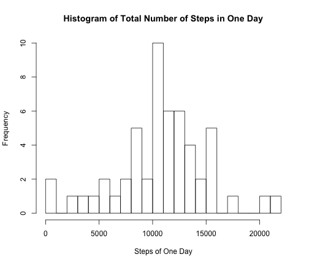
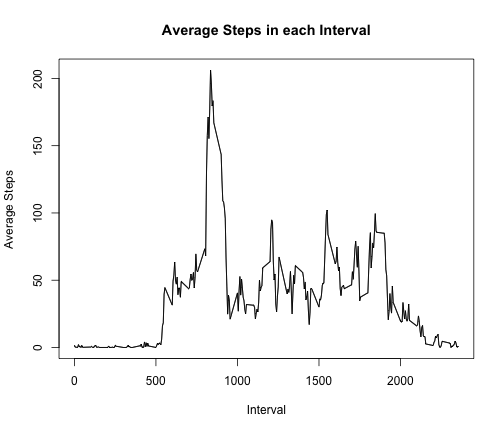
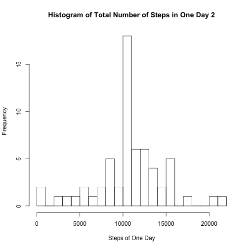
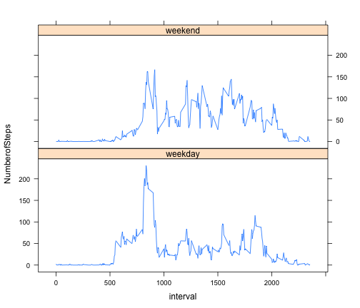

Reproducible Research: Peer Assessment 1
========================================================
# Load and preprocessing the data
## 1. Load the data

```r
data<-read.csv("activity.csv")
```
## 2. Process/transform the data (if necessary) into a format suitable for your analysis

```r
data1<-data[complete.cases(data),]
```

# What is mean total number of steps taken per day?
## Make a summary dataset of total number of steps taken each day

```r
Daysum<-aggregate(list(Totalsteps=data1$steps),list(date=data1$date),sum)
```

## 1. Make a histogram of the total number of steps taken each day

```r
hist(Daysum$Totalsteps, main="Histogram of Total Number of Steps in One Day",xlab="Steps of One Day",breaks=20)
```

 
## 2. Calculate and report the mean and median total nuber of steps taken per day
### mean

```r
Mean1<-mean(Daysum$Totalsteps)
print(Mean1)
```

```
## [1] 10766
```
### median

```r
Median1<-median(Daysum$Totalsteps)
print(Median1)
```

```
## [1] 10765
```

# What is the average daily activity pattern?
## Make a dataset of average number of steps accross each day taken in each 5-minutes interval

```r
Imean<-aggregate(list(Meansteps=data1$steps),list(interval=data1$interval),mean)
```

## 1. Make a time series plot (i.e. type = "l") of the 5-minute interval (x-axis) and the average number of steps taken, averaged across all days (y-axis)

```r
plot(Imean$interval,Imean$Meansteps,type="l", main="Average Steps in each Interval",xlab="Interval",ylab="Average Steps")
lines(Imean$interval,Imean$Meansteps)
```

 

## 2.Which 5-minute interval, on average across all the days in the dataset, contains the maximum number of steps?

```r
Imean[(Imean$Meansteps==max(Imean$Meansteps)),1]
```

```
## [1] 835
```

# Imputing missing values
## 1.Calculate and report the total number of missing values in the dataset 

```r
sum(!complete.cases(data))
```

```
## [1] 2304
```

## 2.Filling in all of the missing values with the mean for that 5-minute interval

```r
data2<-merge(data,Imean,by="interval")
for(i in 1:nrow(data)){
  if(is.na(data2$steps[i])) data2$steps[i]<-data2$Meansteps[i]
}
```

## 3.Create a new dataset that is equal to the original dataset but with the missing data filled in.

```r
data2<-data2[order(data2$date,data2$interval),]
data2<-data2[,c(2,3,1)]
```

## 4. Make a histogram of the total number of steps taken each day and Calculate and report the mean and median total number of steps taken per day. 

```r
Daysum2<-aggregate(list(Totalsteps=data2$steps),list(date=data2$date),sum)
hist(Daysum2$Totalsteps, main="Histogram of Total Number of Steps in One Day 2",xlab="Steps of One Day",breaks=20)
```

 

```r
Mean2<-mean(Daysum2$Totalsteps)
print(paste("Mean is", Mean2))
```

```
## [1] "Mean is 10766.1886792453"
```

```r
Median2<-median(Daysum2$Totalsteps)
print(paste("Median is", Median2))
```

```
## [1] "Median is 10766.1886792453"
```
## Do these values differ from the estimates from the first part of the assignment? What is the impact of imputing missing data on the estimates of the total daily number of steps?
The mean and the median value are different those from first part. As the impurting of the missing value as the mean of the same interval, non-integer numeric values are introduced.

#Are there differences in activity patterns between weekdays and weekends?
## 1.Create a new factor variable in the dataset with two levels -- "weekday" and "weekend" indicating whether a given date is a weekday or weekend day.

```r
data2$weekday<-weekdays(as.Date(data2$date))
for(i in 1:nrow(data2)){
  if(data2$weekday[i] %in% c("Monday","Tuesday","Wednesday","Thursday","Friday")) data2$weekday[i]<-c("weekday")
  if(data2$weekday[i] %in% c("Saturday","Sunday")) data2$weekday[i]<-c("weekend")
}
data2$weekday<-as.factor(data2$weekday)
```

## 2.Make a panel plot containing a time series plot of the 5-minute interval (x-axis) and the average number of steps taken, averaged across all weekday days or weekend days (y-axis). 

```r
Imean2<-aggregate(list(NumberofSteps=data2$steps),list(interval=data2$interval,weekday=data2$weekday),mean)
library(lattice)
xyplot(NumberofSteps~interval|weekday,Imean2,layout=c(1,2),type="l")
```

 


